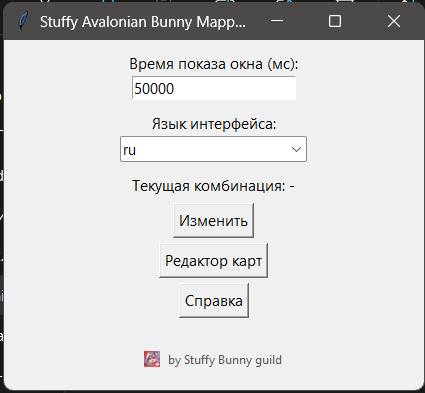
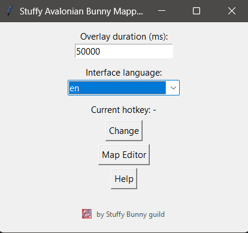
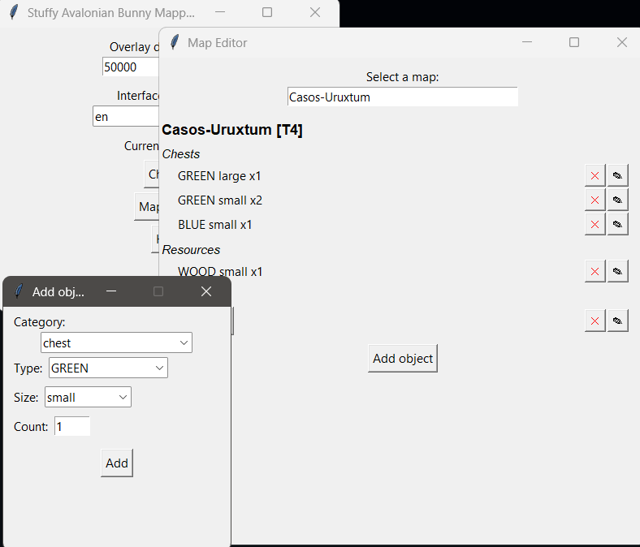
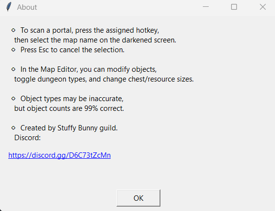

# 🐰 Stuffy Avalonian Bunny Mapper

**Интерактивный помощник для исследования порталов Авалона в Albion Online.**

Наведите камеру на портал, нажмите горячую клавишу, выделите название карты — и получите полный список сундуков, подземелий и ресурсов с размерами и количеством. Всё отображается в стильном полупрозрачном оверлее поверх игры.

Создано с ❤️ гильдией **Stuffy Bunny**.  
[](https://discord.gg/D6C73tZcMn)

---


## ✨ Возможности

- **OCR‑сканирование портала** — выделите название карты на экране, и программа мгновенно покажет её содержимое.
- **Умный поиск** — даже если распознавание немного ошибается, алгоритм найдёт ближайшее совпадение в базе.
- **Наглядный оверлей** — иконки сундуков, ресурсов и данжей с подписями `small`/`large` и точным количеством. Для T8 карт название золотого цвета.
- **Редактор карт** — добавляйте, удаляйте и изменяйте объекты (тип данжа, размер и количество). Все правки сохраняются в `maps.json`.
- **Гибкие настройки** — выбирайте горячую клавишу, время показа оверлея и язык интерфейса (русский или английский).
- **Сворачивание в трей** — закройте окно настроек, и программа продолжит работу в фоне.
- **Портативность** — не требует установки Python или Tesseract. Всё упаковано в одну папку.

---

## 🚀 Быстрый старт (готовый EXE)

1. Скачайте последнюю версию из [релизов](https://github.com/xXxLamerxXx/Avalonian_Stuffy-Bunny_Mapper/releases) (архив `AvalonMapper.zip`).
2. Распакуйте архив в любое удобное место.
3. Запустите `Parser.exe` — откроется окно настроек.
4. В игре нажмите назначенную горячую клавишу (по умолчанию `F9`), затем левой кнопкой мыши выделите название портала на затемнённом экране.
5. Для выхода из режима выделения нажмите `Esc`.

> **Важно:** не перемещайте `Parser.exe` отдельно от остальных файлов — программа ожидает, что `maps.json`, папка `icons` и `Tesseract` находятся рядом с исполняемым файлом.

---

## 📸 Демонстрация

### Основное окно



### Редактор карт


### Справка



-------------------------------------------------------------------------------------------------------------------

## 🔧 Сборка из исходников

Если вы хотите запустить скрипт напрямую или собрать EXE самостоятельно:

### Требования
- Python 3.11 или новее
- Портативный Tesseract OCR (см. ниже)

### Установка зависимостей
```bash
pip install -r requirements.txt


Запуск скрипта
bash
python Parser.py
Сборка EXE с помощью PyInstaller
bash
pyinstaller --onedir --noconsole --add-data "maps.json;." --add-data "icons;icons" --add-data "Tesseract;Tesseract" Parser.py
Перед сборкой поместите портативную версию Tesseract в папку Tesseract (или убедитесь, что путь к tesseract.exe прописан в коде корректно).


📥 Установка портативного Tesseract
Скачайте tesseract-ocr-w64-portable-*.zip со страницы релизов и распакуйте его в папку Tesseract так, чтобы структура была:
Tesseract\
├── tesseract.exe
└── tessdata\
    └── eng.traineddata

📁 Структура репозитория
Avalon-Mapper/
├── Parser.py              # основной скрипт
├── maps.json              # база объектов порталов
├── icons/                 # иконки сундуков, ресурсов, данжей
├── Tesseract/             # (не включён в Git) портативный OCR
├── .gitignore
├── README.md
└── requirements.txt       # список Python-зависимостей

